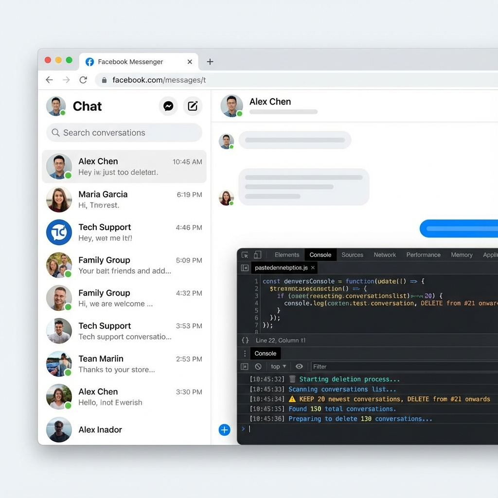
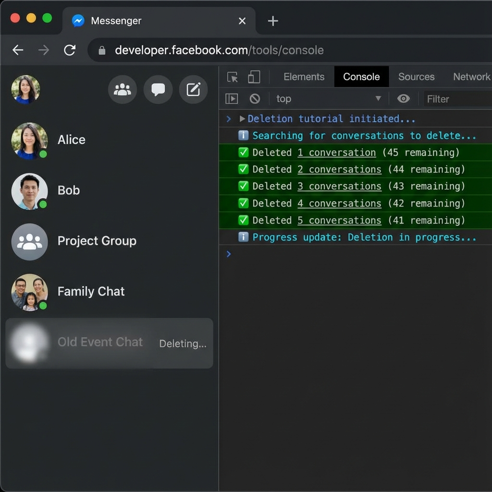
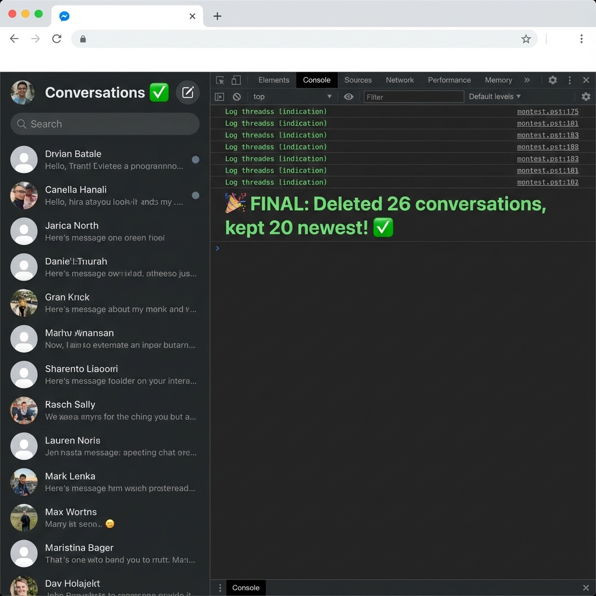

# 🗑️ Facebook Conversation Auto-Delete Script

> **Automate Facebook Chat Deletion with Precision**

A lightweight, browser console-based script that helps you efficiently clean up old Facebook conversations while preserving your most recent chats.


---

## ✨ Features

- ✅ **Smart Filtering** - Keeps your N most recent conversations
- ✅ **User Confirmation** - Requires explicit confirmation before deletion
- ✅ **Automated Deletion** - Delete old conversations one by one
- ✅ **Auto-Redirect** - Automatically navigates to messages list page
- ✅ **Real-time Progress** - Live console logs with emoji indicators
- ✅ **Performance Metrics** - Track deletion speed and efficiency
- ✅ **Safe & Controlled** - Clear visibility of what's being deleted
- ✅ **No Installation** - Runs directly in browser console
- ✅ **Customizable** - Easily adjust how many conversations to keep

---

## 📋 How It Works

1. **Paste** the script into your browser console
2. **Press Enter** to start execution
3. Script **keeps** your 20 most recent conversations (customizable)
4. **Deletes** conversations starting from #21 down to the oldest
5. **Stops automatically** when only your desired number of chats remain

The script uses cursor-assisted filtering to ensure accurate conversation targeting, working seamlessly as long as Facebook's HTML structure remains unchanged.

---

## 🚀 Quick Start

### Prerequisites

- Modern web browser (Chrome, Firefox, Edge, etc.)
- Active Facebook/Messenger account
- Access to browser Developer Tools (F12)

### Installation & Usage

**Step 1: Navigate to Facebook Messages**

Open https://www.facebook.com/messages in your browser.

> **💡 Note:** If you paste the script on a different Facebook page (e.g., News Feed, Profile), it will **automatically redirect** you to the messages list page.

**Step 2: Open Developer Console**

Press `F12` or `Ctrl+Shift+J` (Windows/Linux) / `Cmd+Option+J` (Mac) to open Developer Tools, then click on the **Console** tab.



**Step 3: Paste the Script**

Copy the entire script from `console.js` and paste it into the console.

**Step 4: Execute**

Press `Enter` to run the script. You'll see colorful progress logs:



```
╔════════════════════════════════════════════════════════╗
║      🗑️  FACEBOOK CONVERSATION AUTO-DELETER  🗑️       ║
╚════════════════════════════════════════════════════════╝

⚙️  Configuration:
   • Keep newest: 20 conversations
   • Delete from: Position #21 onwards
   • Started at: 12:30:45 PM

📊 Initial Status:
   • Total conversations: 46
   • To keep: 20
   • To delete: 26

─────────────────────────────────────────────────────────

⚠️  CONFIRMATION REQUIRED

   You are about to DELETE 26 conversations.
   This action is PERMANENT and CANNOT be undone!

─────────────────────────────────────────────────────────
```

**Step 5: Confirm Deletion**

A confirmation dialog will appear asking you to confirm the deletion:

```
⚠️ CONFIRM DELETION

You are about to permanently delete 26 conversations.

• Total conversations: 46
• Will keep: 20 newest
• Will delete: 26 oldest

This action CANNOT be undone!

Click OK to proceed, or Cancel to abort.
```

- Click **OK** to proceed with deletion
- Click **Cancel** to abort (no conversations will be deleted)

If you cancel, you'll see:

```
❌ Deletion cancelled by user.

   No conversations were deleted.
```

If you confirm, deletion will begin:

```
✅ User confirmed. Proceeding with deletion...

🚀 Starting deletion process...
```

**Step 6: Monitor Progress**

The script will show real-time progress:


```
🎯 Target: Position #21
   Name: "John Doe - Hey, how are you..."
   Progress: 0/26 deleted | 26 remaining
   ⏳ Opening menu...
   📋 Found 4 menu items
   ✓ Found delete option: "Delete chat"
   ⏳ Clicking delete...
   📋 Found 3 dialog buttons
   ✓ Confirming deletion...
   ✅ SUCCESS! Deleted 1/26

🎯 Target: Position #21
   Name: "Jane Smith - Thanks for the..."
   Progress: 1/26 deleted | 25 remaining
   ⏳ Opening menu...
   📋 Found 4 menu items
   ✓ Found delete option: "Delete chat"
   ⏳ Clicking delete...
   📋 Found 3 dialog buttons
   ✓ Confirming deletion...
   ✅ SUCCESS! Deleted 2/26

...

─────────────────────────────────────────────────────────
✅ DELETION COMPLETE!

📊 Final Statistics:
   • Conversations remaining: 20
   • Successfully deleted: 26
   • Failed attempts: 0
   • Skipped: 0
   • Time elapsed: 78s
   • Average per deletion: 3.0s

🎉 Kept 20 newest conversations!
─────────────────────────────────────────────────────────
```

**Step 7: Completion**

The script will finish and show final statistics:



---

## ⚙️ Customization

### Change Number of Conversations to Keep

Edit this line in `console.js`:

```javascript
const keepNewest = 20; // Change to your desired number
```

**Examples:**

```javascript
const keepNewest = 10; // Keep 10 newest, delete rest
const keepNewest = 30; // Keep 30 newest, delete rest
const keepNewest = 50; // Keep 50 newest, delete rest
```

### Adjust Deletion Speed

Modify wait times for faster/slower deletion:

```javascript
await wait(500); // Hover wait (default: 500ms)
await wait(700); // Menu wait (default: 700ms)
await wait(1000); // Confirmation wait (default: 1000ms)
```

---

## 📊 Console Output Reference

### Redirect Messages

| Message                                                         | Meaning                                    |
| --------------------------------------------------------------- | ------------------------------------------ |
| `🔄 Redirecting to Facebook Messages...`                        | Not on Facebook Messages, auto-redirecting |
| `🔄 You are in a conversation. Redirecting to messages list...` | In a specific chat, going back to list     |
| `✅ On correct page. Starting script...`                        | Already on messages list, proceeding       |

### Configuration Messages

| Message                                        | Meaning                             |
| ---------------------------------------------- | ----------------------------------- |
| `╔═══ FACEBOOK CONVERSATION AUTO-DELETER ═══╗` | Script header                       |
| `⚙️ Configuration:`                            | Shows script settings               |
| `• Keep newest: 20 conversations`              | Number of conversations to preserve |
| `• Delete from: Position #21 onwards`          | Starting position for deletion      |
| `• Started at: 12:30:45 PM`                    | Timestamp when script started       |

### Status Messages

| Message                     | Meaning                                |
| --------------------------- | -------------------------------------- |
| `📊 Initial Status:`        | Summary of found conversations         |
| `• Total conversations: 46` | Total conversations detected           |
| `• To keep: 20`             | Number that will be preserved          |
| `• To delete: 26`           | Number that will be deleted            |
| `⚠️ Nothing to delete!`     | Total ≤ keep setting, no action needed |

### Confirmation Messages

| Message                                          | Meaning                                |
| ------------------------------------------------ | -------------------------------------- |
| `⚠️ CONFIRMATION REQUIRED`                       | User must confirm before deletion      |
| `You are about to DELETE X conversations`        | Shows number to be deleted             |
| `This action is PERMANENT and CANNOT be undone!` | Warning about permanence               |
| `✅ User confirmed. Proceeding with deletion...` | User clicked OK, deletion starting     |
| `❌ Deletion cancelled by user.`                 | User clicked Cancel, script aborted    |
| `No conversations were deleted.`                 | Confirmation that abort was successful |

### Deletion Progress

| Message                                  | Meaning                                 |
| ---------------------------------------- | --------------------------------------- |
| `🎯 Target: Position #21`                | Current conversation being processed    |
| `Name: "John Doe..."`                    | Conversation name (trimmed to 30 chars) |
| `Progress: 5/26 deleted \| 21 remaining` | Detailed progress counter               |
| `⏳ Opening menu...`                     | Clicking "More" button                  |
| `📋 Found 4 menu items`                  | Menu options detected                   |
| `✓ Found delete option: "Delete chat"`   | Delete option located                   |
| `⏳ Clicking delete...`                  | Initiating deletion                     |
| `📋 Found 3 dialog buttons`              | Confirmation dialog buttons             |
| `✓ Confirming deletion...`               | Clicking confirm button                 |
| `✅ SUCCESS! Deleted 5/26`               | Successful deletion                     |

### Error Messages

| Message                                  | Meaning                             |
| ---------------------------------------- | ----------------------------------- |
| `❌ Menu button not found - skipping...` | Cannot find "More" button, skipped  |
| `❌ Delete option not found in menu`     | Menu lacks delete option            |
| `❌ Confirmation button not found`       | Can't find confirm button in dialog |
| `❌ Confirmation dialog not found`       | Dialog didn't appear                |

### Final Summary

| Message                            | Meaning                       |
| ---------------------------------- | ----------------------------- |
| `✅ DELETION COMPLETE!`            | Process finished successfully |
| `📊 Final Statistics:`             | Summary section               |
| `• Conversations remaining: 20`    | Final count                   |
| `• Successfully deleted: 26`       | Total deleted                 |
| `• Failed attempts: 0`             | Number of failures            |
| `• Skipped: 0`                     | Conversations skipped         |
| `• Time elapsed: 78s`              | Total time taken              |
| `• Average per deletion: 3.0s`     | Average time per conversation |
| `🎉 Kept 20 newest conversations!` | Success message               |

---

## ⚠️ Important Notes

### **Permanent Deletion**

- ⚠️ Deleted conversations **CANNOT be recovered**
- ⚠️ This action is **PERMANENT**
- ⚠️ Make sure you want to delete before running

### **Facebook Structure Dependency**

- Script relies on Facebook's current DOM structure
- May break if Facebook updates their HTML/CSS
- Test on a small number first to verify functionality

### **Manual Stop**

To stop the script at any time:

- Refresh the page (`F5`)
- Close the tab
- Restart your browser

### **Rate Limiting**

- Script includes delays to avoid triggering Facebook's rate limits
- Deleting very large numbers of conversations may take time
- Do not reduce wait times too much to avoid issues

---

## 🛠️ Troubleshooting

### Script doesn't start

- ✅ Ensure you're on `facebook.com/messages`
- ✅ Check console for errors (red text)
- ✅ Verify you pasted the entire script
- ✅ Make sure conversations are loaded in sidebar

### Menu button not found

- ✅ Scroll to ensure conversations are visible
- ✅ Facebook may have changed their UI
- ✅ Try refreshing and running again

### Delete option not found

- ✅ Your Facebook language settings may differ
- ✅ Script supports "Delete" and "Hapus" (Indonesian)
- ✅ Edit script to add your language keyword

### Stops unexpectedly

- ✅ Check console for error messages
- ✅ Facebook may have rate-limited your actions
- ✅ Wait a few minutes and try again

---

## 📁 Project Structure

```
fb/
├── console.js              # Main deletion script
├── README.md              # This file
├── LICENSE                # MIT License
└── docs/
    ├── tutorial_step_1.png
    ├── tutorial_step_2.png
    └── tutorial_step_3.png
```

---

## 🤝 Contributing

Contributions are welcome! If you have improvements or bug fixes:

1. Fork the repository
2. Create a feature branch (`git checkout -b feature/improvement`)
3. Commit your changes (`git commit -am 'Add new feature'`)
4. Push to the branch (`git push origin feature/improvement`)
5. Create a Pull Request

---

## 📝 License

This project is licensed under the MIT License - see the [LICENSE](LICENSE) file for details.

---

## ⚡ Changelog

### Version 1.0.0 (2026-01-04)

- ✅ Initial release
- ✅ Keep N newest conversations feature
- ✅ Automated deletion from oldest to newest
- ✅ Real-time progress logging
- ✅ Error handling and retry logic
- ✅ Customizable configuration

---

## 🙏 Acknowledgments

- Built for efficient Facebook conversation management
- Inspired by the need for bulk conversation cleanup
- Designed with user control and transparency in mind

---

## 📧 Support

If you encounter issues or have questions:

- 📝 Open an issue on GitHub
- 💬 Check existing issues for solutions
- 📖 Read the troubleshooting section above

---

## ⚠️ Disclaimer

**This script is provided "as is" without warranty of any kind.**

- Use at your own risk
- Not affiliated with Facebook/Meta
- Author not responsible for data loss
- Always backup important conversations before deletion
- Test on a small scale first

**By using this script, you acknowledge that you understand the permanent nature of conversation deletion and accept full responsibility for any consequences.**

---

<div align="center">

**Made with ❤️ for efficient conversation management**

⭐ Star this repo if you found it helpful!

</div>
